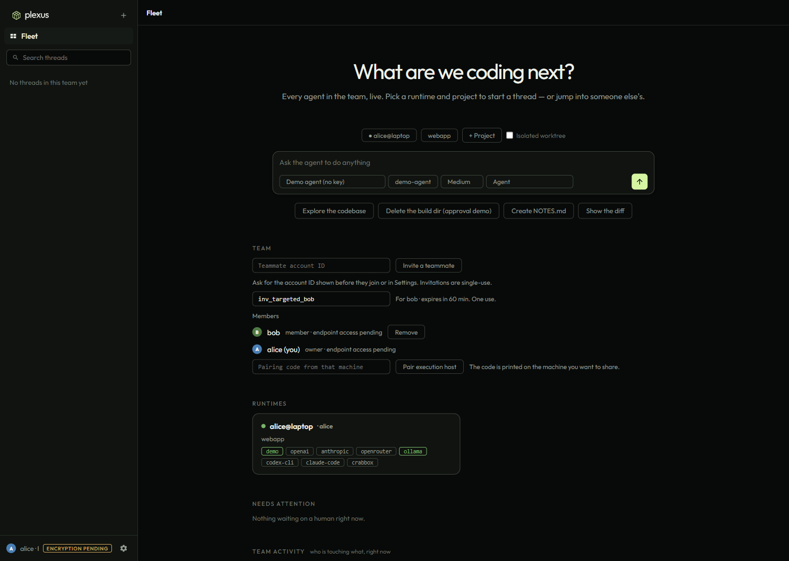
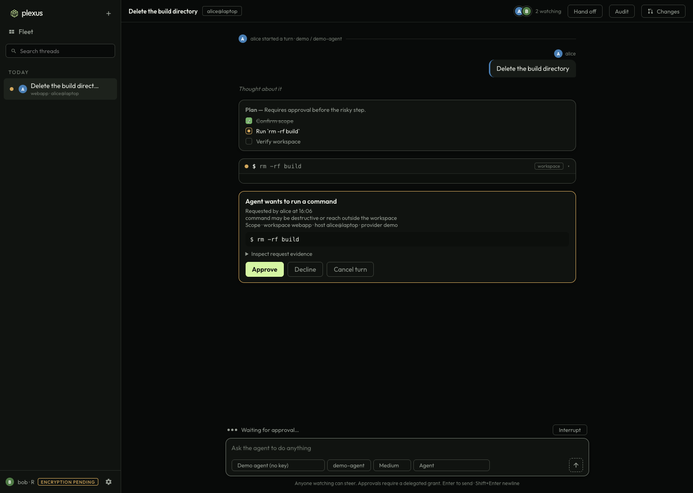
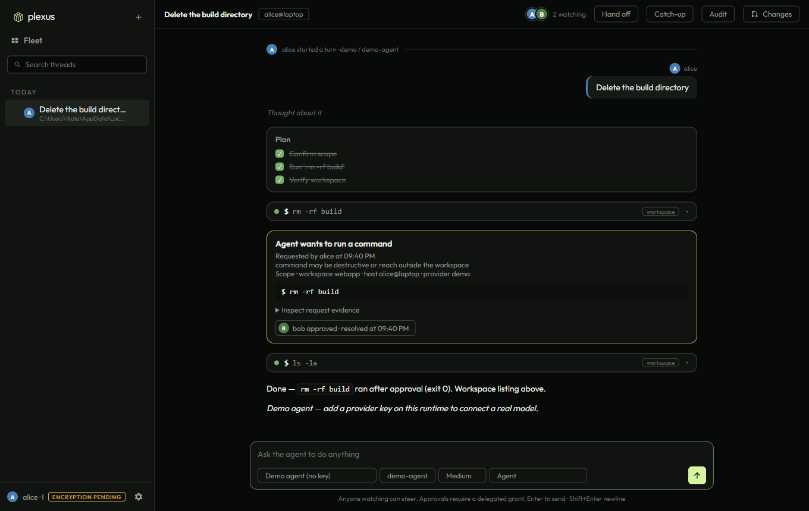
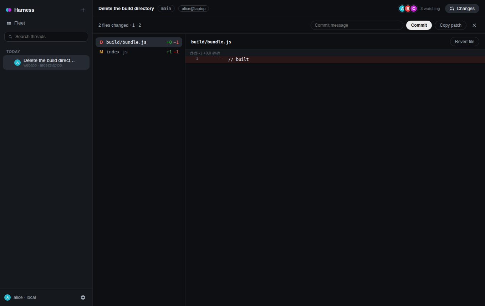
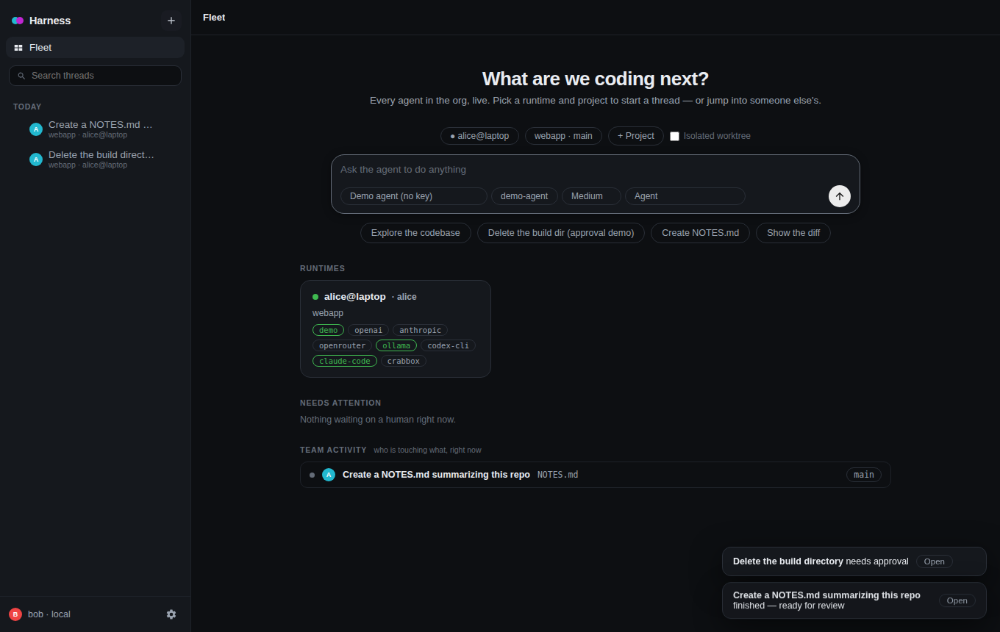
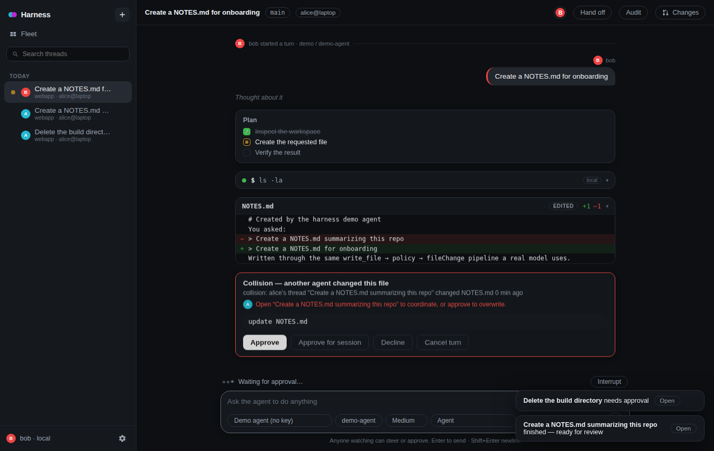

# Multiplayer AI Harness

A working prototype of a **multiplayer, bring-your-own-provider agent workbench** — the
"mission control" layer from the strategy dossier: several people supervise coding agents
together, on inference they already pay for, with keys and code that never leave their machines.

| Fleet | Bob approves Alice's agent | Alice sees it land | Changes review |
| --- | --- | --- | --- |
|  |  |  |  |

| Team activity (who's touching what) | Collision stopped for approval |
| --- | --- |
|  |  |

The repo also still contains the original single-player **Codex desktop clone** it grew out of
(`src/`, run with `npm run codex-clone`; see [docs/](docs/) for its screenshots).

## The demo

1. Alice starts a thread on her runtime: *"Delete the build directory."*
2. Her agent plans, then wants to run `rm -rf build`. Policy says that needs a human.
3. Bob — in his own browser, or on his phone — sees it in **Needs attention**, opens the thread,
   watches the same live stream (presence shows both), and clicks **Approve**.
4. Alice's screen shows *"bob approved"*; the command runs **on Alice's machine**; both watch the
   plan tick to done. Carol joins late and replays the entire log.
5. Bob types while the next turn is running — it lands as an attributed **steer** inside Alice's turn.
6. Alice's agent creates `NOTES.md`; minutes later Bob's agent tries to write the same file. The
   **collision radar** stops it for approval — naming Alice's thread — instead of silently clobbering.
7. Alice **hands the thread off** to Bob with a note; it shows up in his sidebar as assigned to him,
   full session attached. Anyone can **export the audit log** of any thread.

That whole flow is exercised by the browser end-to-end test (`npm run test:e2e`) with two real
Chromium sessions, and it runs offline against the built-in demo agent.

## Architecture

```
alice's machine                          hub (sync service)                 teammates
┌──────────────────────┐                 ┌───────────────────────────┐      ┌──────────────┐
│ desktop / web client │──IPC/WS──┐      │ append-only thread logs   │──WS──│ bob: browser │
│ agent runtime daemon │──WS──────┼─────▶│ presence · fleet registry │◀─WS──│ carol: phone │
│  keys · tools · git  │  append  │      │ command routing (single   │      └──────────────┘
│  worktrees · policy  │◀─commands┘      │ writer per thread)        │
└──────────┬───────────┘                 └───────────────────────────┘
           │ inference: direct, on alice's own keys — never through the hub
           ▼
   OpenAI · Anthropic · Ollama · OpenRouter · Codex CLI · Claude Code CLI
```

- **Hub** (`packages/hub`) — WebSocket + HTTP. Per-thread append-only event log in `node:sqlite`,
  seq numbers, snapshot-on-subscribe, presence, org/user identity, runtime fleet registry, and
  routing of human commands to the one runtime that owns each thread. Also serves the web UI and a
  seq-cursor polling fallback (`GET /api/threads/:id/events?after=N`). It never sees provider keys
  and never runs inference.
- **Runtime** (`packages/runtime`) — headless daemon per machine. Holds provider keys, registers its
  projects, owns threads, runs turns. Provider adapters normalize OpenAI, Anthropic, Ollama /
  OpenAI-compatible, OpenRouter, and the real **Codex CLI** (`codex exec --json`) and **Claude Code
  CLI** (`claude -p --output-format stream-json`) — both translated event-for-event, so teammates
  can bring their own subscriptions — behind one streaming interface; a **demo** provider drives the real tool pipeline
  with no key. Executors run commands **locally** or through a **Crabbox** remote runner.
- **Protocol** (`packages/protocol`) — `thread → turn → item` vocabulary modeled on Codex's
  app-server protocol: `item/started` → deltas → `item/completed`, `turn/plan/updated`,
  `item/commandExecution/requestApproval` answered with `accept | acceptForSession | decline | cancel`,
  `serverRequest/resolved` broadcast to all subscribers, `turn/steer` with `expectedTurnId`.
- **Team awareness & collision radar** — the hub derives, from the event log, which live threads are
  touching which files on each project. It's pushed to every client (fleet "Team activity", overlap
  alerts) *and* to every runtime, which injects it into each agent's system prompt so agents divide
  work instead of duplicating it. Unlike an advisory "shared brain", it's enforced: a second agent
  writing a file another live thread changed in the last 30 minutes is escalated to a human approval
  that names the other thread. Isolated worktrees downgrade this to a merge-risk warning.
- **Handoff & audit** — assign a thread to a teammate with a note (an attributed event; they get an
  "assigned to you" inbox), and export any thread's full event log as JSON.
- **Policy engine** — Codex's `untrusted | on-request | never` approval policies ×
  `read-only | workspace-write | danger-full-access` sandboxes, plus a trusted read-only command list
  and a risky-command heuristic. Every agent action resolves to *allow / ask / deny*; *ask* becomes a
  routable approval anyone in the org can answer.
- **Web UI** (`apps/web`) — one vanilla-JS client used by browsers and the desktop shell: fleet view
  (runtime cards, needs-attention queue with inline approve), org-wide thread list with live status,
  shared thread view with presence avatars, attributed messages/steers/approvals, plan / command /
  file-change cards, and a Changes panel (diff, commit, revert, copy patch) served by the runtime.
- **Desktop shell** (`apps/desktop`) — Electron: spawns a local hub + runtime, loads the same UI,
  adds a native folder picker. Point it at a remote hub with `HUB_HTTP_URL`.

Why an event log and not CRDTs: each thread has exactly one writer (its runtime). Humans send
commands; the runtime turns them into events. Late-join, replay, audit, and polling fallback all fall
out of "replay from seq N".

## Run it

```bash
npm install

# 1. hub (serves the UI on http://127.0.0.1:7777)
npm run hub

# 2. a runtime on any machine that should execute agents (keys stay here)
OPENAI_API_KEY=sk-… node packages/runtime --hub ws://127.0.0.1:7777 --name alice --project ~/code/myrepo
#    no key? the demo provider works out of the box; Ollama works with OLLAMA_BASE_URL

# 3. open http://127.0.0.1:7777 in as many browsers as you like (each picks a name)
```

Or the desktop shell, which does 1–3 for you: `npm run desktop` (`HARNESS_PROJECTS=/path/a:/path/b`).

Runtime config can also live in `~/.harness/runtime.json`:

```json
{ "hub": "ws://hub.example:7777", "org": "acme", "user": "alice",
  "projects": ["/home/alice/code/api"], "executor": "local",
  "providers": { "anthropic": { "apiKey": "…" }, "openai": { "apiKey": "…" } } }
```

## Tests

```bash
npm run test:unit       # policy matrix, codex exec JSONL translator, diff, hub store
npm run test:protocol   # scripted hub + runtime + two WebSocket clients (no browser)
npm run test:codex      # Codex acceptance harness, control lane only (no provider spend)
npm run test:e2e        # two real Chromium users: approve / steer / late-join / changes / worktree
npm run test:desktop    # Electron shell boots hub + runtime and runs a turn (needs xvfb)
npm run smoke           # the original Codex-clone smoke test
```

### Proving it against the real Codex CLI

```bash
npm run codex:probe     # which codex, what version, which auth, which capability gaps
npm run proof:codex     # every lane this machine allows: control + subscription + API key
```

`proof:codex` runs real `codex exec` turns and spends real provider quota. It writes a
result matrix and Codex's own event stream to [docs/proofs/](docs/proofs/); the contract it
establishes - pinned version, platform prerequisites, auth modes, usage owner and the gaps
that have no answer yet - is written up in
[docs/proofs/codex-shared-control.md](docs/proofs/codex-shared-control.md).

## Layout

```
packages/protocol/       event + command vocabulary (Codex-style names)
packages/hub/            server.js (WS/HTTP), store.js (sqlite event log)
packages/runtime/        index.js (daemon/CLI), session.js (turn loop, tools, approvals, team awareness),
                         providers.js, codex-exec.js, claude-code.js, executors.js (local, crabbox),
                         policy.js, git.js, diff.js, store.js, hub-client.js
apps/web/                shared UI (index.html, app.js, styles.css, markdown.js)
apps/desktop/            Electron shell
src/                     the original Codex desktop clone (single-player)
test/                    unit, protocol smoke, browser e2e, desktop smoke, clone smoke
```

## References & attribution

- **openai/codex** (Apache-2.0) was used as the reference for the protocol shape — thread/turn/item
  types, notification and approval names, decision enums, approval/sandbox policy vocabulary, and the
  `codex exec --json` event format the `codex-cli` adapter consumes. This repository is an independent
  JavaScript implementation; no Codex source code is included.
- **openclaw/crabbox** (MIT) informed the execution model: control-plane/data-plane separation,
  seq-cursored event streams with an HTTP polling fallback, "only `exitCode` is success", and the
  `crabbox run -- <cmd>` executor integration. No Crabbox source code is included.

## Status & known gaps

This is a prototype, not a product: identity is name-based (no SSO), the hub has no TLS or
per-thread ACLs, sandboxing is policy + worktrees (no containers yet), and the Codex-CLI and Crabbox
adapters are integration-tested only against fixtures because neither binary is present in CI.
The dossier's Phase 2 exit criterion — *"Alice's agent hits an approval wall, Bob approves from his
phone, both watch the diff land live"* — is what this repo demonstrates.

## Implementation planning

The [planning index](docs/planning/README.md) links the current implementation spec, team issues,
accepted decisions, and supporting research. Start with [spec issue #1](https://github.com/Retia-Labs/multiplayer-ai-harness/issues/1)
and the [team issue breakdown](docs/planning/team-issue-breakdown.md). The spec describes the work
required for early access; it does not claim that the prototype already satisfies those requirements.
