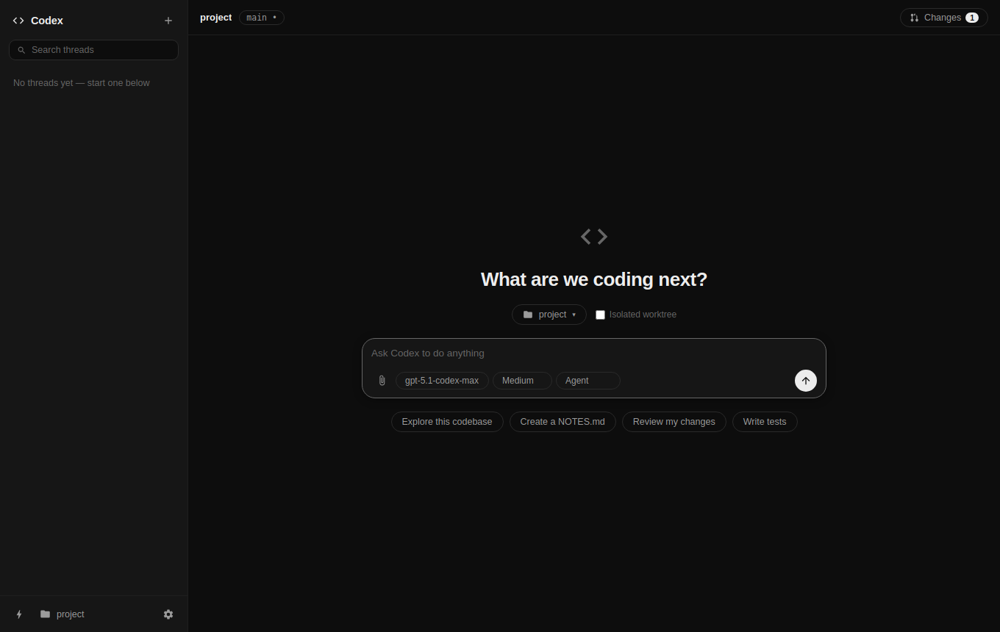
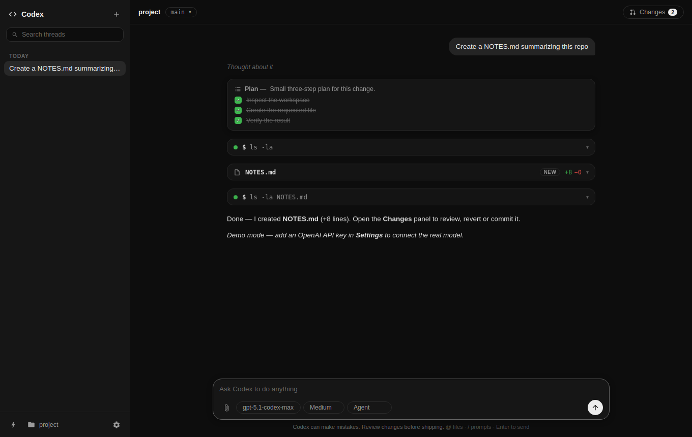
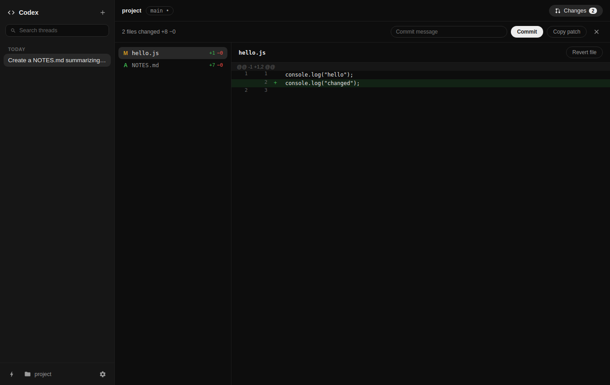

# Codex Desktop Clone

A working clone of the OpenAI **Codex desktop app**, built with Electron. It reproduces the
core experience end to end: the home hero, threads, an agentic loop with plan checklists and
file-edit cards, approval modes, isolated git worktrees, a two-pane Changes review panel with
commit, automations, and more.

| Home | Thread | Changes review |
| --- | --- | --- |
|  |  |  |

## Features

**Agentic chat**
- Real agent loop with three tools: `shell` (streaming output), `write_file` (rendered as
  collapsible diff cards), and `update_plan` (a live step checklist that updates in place).
- With an **OpenAI API key** (Settings), messages go to the Chat Completions API with
  streaming, function calling, reasoning effort, and token-usage reporting per turn.
- Without a key, an offline **demo agent** streams simulated reasoning/replies but drives the
  same real tool pipeline — it actually writes files and runs commands.
- **Reasoning items** ("Thought about it") with a shimmer while thinking, collapsible after.
- **Steer mid-run**: sending while a turn is running queues the message into the loop
  (rendered as a dashed bubble), like steering in Codex.
- **Stop** button, error surfaced inline, per-turn token usage in the top bar.

**Approval modes** (like the real app)
- `Read Only` — only safe inspection commands; no file writes.
- `Agent` — safe commands auto-run; risky commands and out-of-workspace writes show an
  inline **Approve / Deny** card.
- `Full Access` — everything auto-runs.

**Threads**
- Persistent, searchable, date-grouped, auto-titled; rename via double-click.
- **Parallel turns**: multiple threads can run at once. The sidebar shows a spinner while a
  thread works, an amber dot when it's waiting for approval, and a green **Ready** badge when
  it finished in the background (plus a desktop notification + toast).
- **Archive** threads into a collapsible section, or delete them.
- **Isolated worktrees**: toggle on the home screen to run a thread in its own
  `git worktree` on a `codex/*` branch, so the agent never touches your checkout.
  Worktrees are cleaned up when the thread is deleted.

**Composer**
- `@` file mentions with fuzzy autocomplete over `git ls-files`.
- `/` slash prompts — built-ins (`/review`, `/explain`, `/tests`, `/commit-msg`) plus
  custom prompts you define in Settings.
- Image attachments (sent as multimodal input to the API), model picker,
  **reasoning effort** selector (Low → Extra high), access-mode picker.
- Home-screen hero with suggestion chips and a project dropdown (recents + open folder).

**Changes review panel**
- Two-pane review: file list (A/M/D + per-file stats) and a line-numbered diff table,
  untracked files included.
- **Commit** (message box → `git add -A && git commit`), **Copy patch** to clipboard,
  **Revert file** / delete untracked, live changed-file badge in the top bar.

**Automations**
- Recurring prompts (hourly → weekly) that spawn fresh `⚡` threads on schedule, with
  per-automation access mode, pause/resume, run-now, and delete.

**Polish**
- Dark & light themes, toasts, desktop notifications (toggleable), animations, thread-scoped
  branch display, worktree badge, persistent settings/threads on disk.

## Run it

```bash
npm install
npm start
```

On a headless machine: `xvfb-run -a npm start`.

## Test it

An end-to-end smoke test launches the real app with Playwright, creates a scratch git repo,
and drives the whole surface — demo agent (reasoning, plan, file edit, shell), @ mentions,
slash prompts, the Changes panel including a real commit, worktree threads, archiving,
automations, and settings (33 assertions). It also produces the README screenshots:

```bash
xvfb-run -a npm run smoke
```

## Layout

```
src/main/main.js      Electron main process, IPC wiring, automations scheduler
src/main/store.js     Settings, threads, automations persistence (JSON in userData)
src/main/agent.js     Agent loop: OpenAI + demo backends, tools (shell / write_file /
                      update_plan), approvals, steering queue, line-diff for edit cards
src/main/gitutils.js  Branch/status/diff/commit/revert/patch + worktree management
src/main/preload.js   contextBridge API exposed to the renderer
src/renderer/         UI (vanilla JS, no build step): index.html, styles.css, app.js, markdown.js
test/smoke.js         Playwright end-to-end smoke test
```

## Notes

- Not affiliated with OpenAI; this is a functional homage for experimentation.
- The API key is stored locally in `userData/settings.json` and only sent to the base URL
  you configure (default `https://api.openai.com/v1`).
