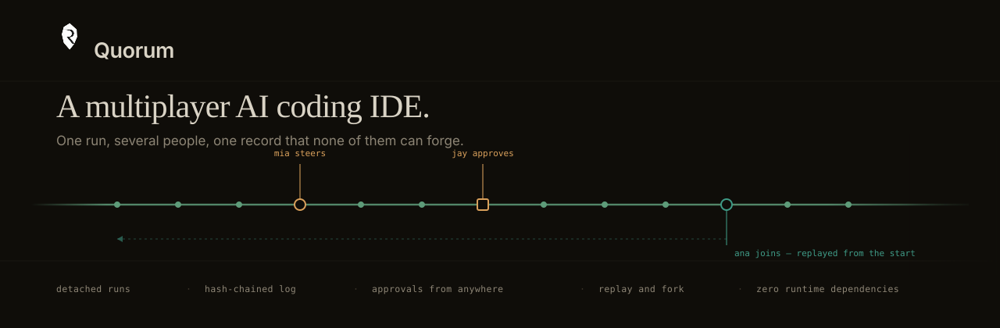
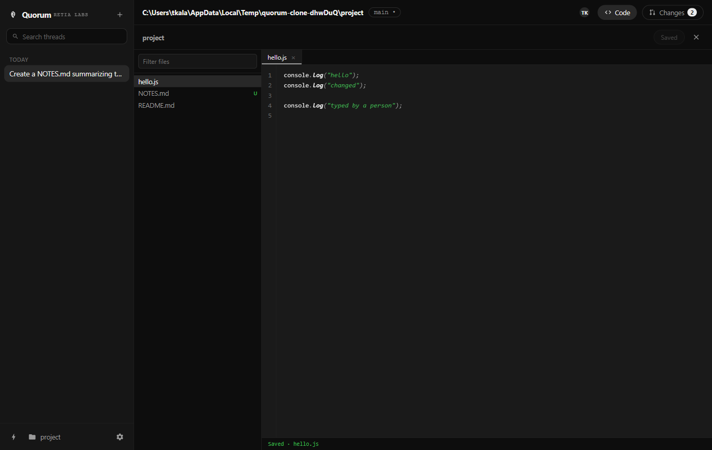

<div align="center">



**A multiplayer AI coding IDE.** One run, several people, one record that none of them can forge.

[](#tests)
[](#tests)
[](#no-dependencies)
[](https://electronjs.org)
[](#install)
[](LICENSE)
[](#)

[Install](#install) · [Working together](#working-together) · [How it works](#how-it-works) · [CLI](#command-line) · [Tests](#tests)

</div>

---

You start a run. Someone else joins it with a code and watches the agent work,
talks in it, steers it mid-flight, and answers its approvals — from their own
machine, without installing your repo. The run lives in its own process, so it
keeps going when you close the laptop.

| Home | Thread | Code | Changes |
| :---: | :---: | :---: | :---: |
|  |  |  |  |

## The one idea

Everything here follows from a single decision: **the run does not live inside
the window.**

A run is a detached process that owns an append-only, hash-chained log. The
window is one of its readers. So is a colleague on another continent. Neither is
privileged — which is why a second person is possible at all. There is nothing
special about being the process that pressed Start.

```
                        ┌──────────── your window
   the agent ──► the runner ─────────┼──────────── their window
                  (single writer,    └──────────── a phone answering a gate
                   ordered, chained)
```

The runner is the only thing that writes. Everyone else submits **intents** —
requests the run may accept. That asymmetry is the whole safety story: several
people can take part in a run and none of them can rewrite what happened.

## Install

Download the installer for your platform from Releases, or build it yourself:

```bash
npm install
npm run dist        # installers into dist/
npm run dist:dir    # unpacked, for a quick look
```

Run from source:

```bash
npm install
npm start
```

Add an OpenAI key in Settings to use a real model. Without one it runs an offline
demo agent that still drives the real tool pipeline — it genuinely writes files
and runs commands, so everything below is true either way.

## Working together

One person hosts. Everyone points at the same relay: one small process that
stores no code, runs no agent, and only passes messages between a run and the
people in its room.

```bash
npm run relay                 # or: quorum relay --port 7788
```

Put its address in Settings on each machine, then:

| | |
| --- | --- |
| **Host** | Open a run → **Share** → read out the code (`CXNQ-Q2WH`) |
| **Guest** | **Join a session** → type the code |

The guest is replayed everything that happened before they arrived, then follows
it live. They can talk, steer the agent mid-run, and answer its approval
prompts. The host's runner still decides what actually enters the log.

The relay only ever holds a mirrored copy. Losing it loses no work — every run
keeps its own log on the machine doing the work.

## How it works

<table>
<tr><td width="34%"><b>Detached runs</b></td>
<td>The agent loop is its own OS process, not an object in the window. Quit the app and the run continues; reopen it and it reattaches. A dead runner is never reported as live — on Windows a hard kill skips signal handlers entirely, so liveness is checked rather than assumed.</td></tr>

<tr><td><b>Approvals as facts, not modals</b></td>
<td>A risky command raises a <i>gate</i>: an event in the log rather than a dialog on one machine. Anyone authorised can answer it from anywhere, the answer is recorded against a person, the first answer wins, and the agent cannot approve itself.</td></tr>

<tr><td><b>Steering, honestly recorded</b></td>
<td><code>directive.sent</code>, <code>directive.applied</code> and <code>directive.honored</code> are three separate events. The agent merging your words into its context is not proof it obeyed, and the record should not claim otherwise.</td></tr>

<tr><td><b>Tamper evidence</b></td>
<td>Every event commits to the one before it. Editing or removing any earlier event breaks every hash after it. A secret an agent printed can still be redacted without breaking the chain, because the chain commits to the payload's <i>digest</i>, not its text.</td></tr>

<tr><td><b>Code editor</b></td>
<td>File tree, tabs, line numbers and syntax highlighting in a few hundred lines with no editor library — a highlighted <code>&lt;pre&gt;</code> under a transparent <code>&lt;textarea&gt;</code>. It edits the same workspace the agent is in, and a save that would overwrite the agent's work is refused rather than performed.</td></tr>

<tr><td><b>Isolated worktrees</b></td>
<td>A thread can run on its own <code>quorum/*</code> branch, so the agent never touches your checkout.</td></tr>

<tr><td><b>Replay and fork</b></td>
<td>The log is ordered and the reducer is pure, so the run can be rendered as it stood at any moment — and forked from there into its own worktree, carrying the history that led to the decision.</td></tr>

<tr><td><b>GitHub</b></td>
<td>Clone, push, open a pull request through the <code>git</code> and <code>gh</code> you already have configured. There is no token for this app to store. Cloning is also how a guest gets the code: git already moves source between machines well.</td></tr>

<tr><td><b>Behind NAT, with no setup</b></td>
<td>The runner dials <i>out</i> to the relay and long-polls for intents. Both connections are outbound, so sharing works from a coffee shop without forwarding a port.</td></tr>
</table>

## Command line

Everything the desktop does is the session protocol underneath, so all of it
works without a window — including on a server with no display.

```bash
quorum run "fix the failing auth test"   # starts a run; survives this terminal
quorum ls                                # live runs on this machine
quorum watch t_19a2f                     # follow one
quorum say  t_19a2f "use the refresh path"
quorum share t_19a2f                     # print a room code
quorum verify t_19a2f                    # check the chain is intact
quorum stop t_19a2f
```

## Tests

```bash
npm test        # 86 unit and integration tests
npm run smoke   # 48 assertions against the real app, driven by Playwright
```

The integration tests spawn real runner processes and a real relay rather than
mocking them, and prove the claims that actually matter:

- a run survives its client disconnecting entirely
- a second machine joins with only a code and is caught up from the beginning
- a remote person can steer a run and answer its approvals
- a member of a room **cannot** forge the record
- a person's save cannot silently clobber the agent's work

## No dependencies

Zero runtime dependencies. The log, the reducer, the HTTP and SSE server, the
client, the relay, the syntax highlighter and the editor are all written here
against the Node standard library. `electron` and `playwright-core` are dev
dependencies; `electron-builder` packages the installers.

This is not asceticism. A tool that audits what an agent did is worth less if
nobody can read what it does itself.

## What this is not

There is no LSP, no multi-cursor, no folding, and no real-time co-editing of one
buffer. The editor exists so you can read and correct what the agent did without
leaving the run — not to replace the editor you already have open.

Multiplayer here means watching, steering, approving and handing off **one run**.
That is a different product from several people typing in one file, and it is
the one worth building first: the moments a run blocks on a human it cannot
reach are real today.

## Licence

MIT © [Retia Labs](https://retialabs.com)
