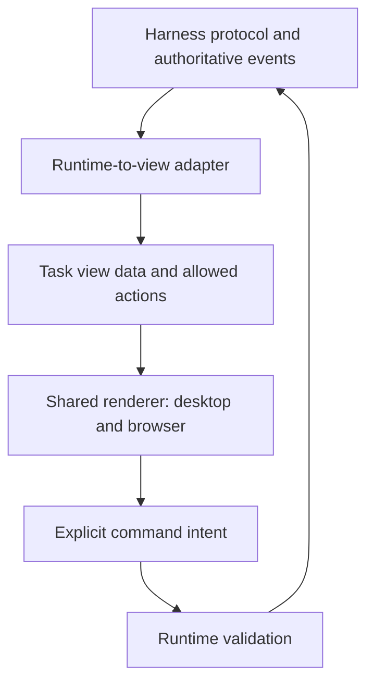

# Building the Plexus desktop app from this prototype

Use this prototype as the team's visual reference and interaction specification. Production behavior must come from the multiplayer harness. The reference pack is versioned here in the multiplayer harness repository. Its nine screens demonstrate selected workflows from the [current product specification](../../planning/product-spec.md), published as [issue #1](https://github.com/Retia-Labs/multiplayer-ai-harness/issues/1); they do not establish complete specification coverage.

For agent-assisted implementation, use [AGENT-DEVELOPMENT.md](AGENT-DEVELOPMENT.md). It includes the repository instruction to load these references, a task prompt, and the distinction between agent guidance and enforceable merge checks.

## 1. Start every screen from the same reference

| Reference | What the team takes from it |
| --- | --- |
| [Selected direction](design/selected-direction.png) | Overall composition and visual intent |
| [Rendered review](design/qa/review-desktop.png) | The implemented desktop review at 1487 × 1058 |
| [Mobile review](design/qa/review-mobile.png) | The narrow review layout; use the same fixed 390 × 844 viewport for future checks |
| [Design system](DESIGN-SYSTEM.md) | Measurements, typography, component props, responsive drawers, and semantic rules |
| [Design tokens](design/plexus-app.tokens.json) | Shared colors, type, spacing, radii, and motion values |
| [Template contracts](design/screen-templates.json) | Required slots, state inventory, and meanings that survive layout changes |
| [Shared primitives](src/ui.jsx) and [styles](src/styles.css) | Component anatomy and visual behavior |
| [App interactions](src/App.jsx), [management screens](src/management-screens.jsx), and [fixtures](src/data.js) | Inspectable examples of flows and sample data; not production command handling |

Before implementing a ticket, record its screen, template IDs, required states, and any intentional departure from these references. Open the prototype's Templates screen to inspect or copy a contract. Use source JSON as the editable reference; `public/exports/` contains download copies.

## 2. Reuse the existing shared renderer

The harness currently shares a vanilla-JavaScript renderer in `apps/web/` between the browser and Electron desktop shell. The React/Vite prototype is a separate environment. Start by bringing its design into that shared renderer; a React migration is a separate team decision. The integration map below was verified on 2026-09-06 at commit `c57bdad0b37b61cb602fd3f088aec91a3d6ba761`; its links point to this checkout so agents can inspect the current implementation before editing. This reference-pack change does not port the prototype into production.

| Existing harness source | Integration use |
| --- | --- |
| [apps/web/app.js](../../../apps/web/app.js) | Extend the shared renderer. `selectThread`, `applyEvent`, `renderApproval`, `sendMessage`, and `renderDiff` are the existing seams. |
| [apps/web/styles.css](../../../apps/web/styles.css) | Already loads Outfit and semantic variables such as `--bg`, `--bg-raised`, `--text`, `--accent`, `--r-control`, and `--r-panel`. Map the prototype tokens into this vocabulary. |
| [apps/desktop/main.js](../../../apps/desktop/main.js) and [preload.js](../../../apps/desktop/preload.js) | Keep Electron startup, local services, and native folder selection in the desktop boundary. |
| [packages/protocol/index.js](../../../packages/protocol/index.js) | Reuse canonical command names, payloads, and event identities. Do not define a second protocol from prototype strings. |

The root `src/` single-player clone is legacy material; it is not the target renderer for this handoff.

Consolidate one **shared UI layer** consumed by the existing renderer. Its module boundaries should follow the current code; a new package is optional. This extraction remains production implementation work:

| Package responsibility | Initial content | Boundary |
| --- | --- | --- |
| Tokens and assets | Convert [token JSON](design/plexus-app.tokens.json) into CSS custom properties; reuse [Outfit](public/assets/outfit.woff2) and [Plexus SVG](public/assets/plexus-symbol.svg) | No runtime state or platform APIs |
| UI primitives | Port the anatomy of `Avatar`, `Status`, `Button`, `SourceLink`, and `Modal` | Accept data and callbacks; do not execute host commands |
| Screen templates | Implement the six [contracts](design/screen-templates.json) with named slots | Share layouts and semantic state props across both clients |
| Reference fixtures | Deliberate examples derived from [sample data](src/data.js) | Used for development and visual checks only |

Use the current JavaScript rendering approach for the first slice. If the team later adopts React, migrate the shared renderer once so desktop and browser consume the same components. Do not build a second desktop-only copy of these screens.

The prototype has literal CSS values and private `m-*` helpers as well as shared primitives. Treat those as extraction work: replace reusable literals with token references and consolidate equivalent helpers. New colors, spacing, and state variants must enter the shared UI layer before a screen uses them. Where prototype values differ from the existing harness tokens, choose the intended value once in the shared layer rather than overriding it independently in each screen.

## 3. Give every screen a template contract

| Prototype screen | Template IDs | Implementation reference | Keep visible |
| --- | --- | --- | --- |
| Review | `shell`, `review` | [App](src/App.jsx) | Read-only artifact, actor, target turn, receipt, and evidence |
| Workspace | `shell` | [WorkspaceScreen](src/management-screens.jsx) | Tasks, responsibility, and execution context |
| Activity | `shell`, `evidence` | [Activity](src/App.jsx) | Ordered attributed events and source records |
| Catch up | `shell`, `evidence` | [CatchUp](src/App.jsx) | Objective, decisions, freshness, and source links |
| Inbox | `shell`, `inbox` | [InboxScreen](src/management-screens.jsx) | Human request type, recipient, task, and resolution |
| Approval | `shell`, `decision` | [ApprovalScreen](src/management-screens.jsx) | One action, scope, requesting actor, decision maker, and result |
| Setup | `shell`, `setup` | [SetupScreen](src/management-screens.jsx) | Workspace, host, provider, and actual setup capability |
| Access | `shell`, `setup` | [AccessScreen](src/management-screens.jsx) | Project grants, devices, and pending revocation |
| Templates | `shell` | [TemplatesScreen](src/templates.jsx) | Internal reference gallery; not a required end-user feature |

Reuse component anatomy with explicit state props. A delivery receipt needs actor, recipient, target turn, state, and source reference. A decision panel needs the action, scope, eligible actor, pending/settled state, and decision callback. A source view needs the original event identity and content. Pass these values in; avoid deriving them from names, accent colors, or unrelated task state.

## 4. Put authoritative events between the runtime and the UI

Keep a runtime-to-view adapter between harness events and presentation. Reuse the harness's canonical protocol types and identifiers; the numeric turns and display strings in [App.jsx](src/App.jsx) are demo values. The existing thread fields include `id`, `runtimeId`, `runtimeName`, `assignee`, `activeTurnId`, `status.type`, and `activeFlags`. Project those into the task view without collapsing their meanings. Components render that view and emit user intent.

| Construct | Shared rendering rule |
| --- | --- |
| Responsibility, host, provider, actor | Separate fields. Handing off responsibility keeps the execution host and provider account. |
| Grants and membership | Separate from responsibility. Derive action availability from current project/device grants; hiding a button is not authorization enforcement. |
| Host, turn, outcome | Independent facts. “Host unavailable” leaves execution status unknown; it does not mean stopped or failed. |
| Agent instruction | Preserve actor, target turn, and command identity. Show acceptance separately from delivery. Reject stale turns; do not automatically replay an uncertain command after reconnecting. |
| Interruption | Keep “Interrupt requested” until the host acknowledges it. |
| Approval | Bind to one action and its turn/scope. Render the first valid settled decision or expiry; do not infer a blanket grant. |
| Human help | A separate request with recipient and open/resolved state. Replies do not become agent input without an explicit send. |
| Evidence | Render stable source references and timestamps. Never replace missing evidence with a fabricated successful result. |

Put these state meanings in shared fixtures and adapters, not separate screen-specific booleans. Local UI state is appropriate for an open drawer or unsent draft. It is not the authority for connection, delivery, approval, access, or execution results. Remove the prototype's timer-based receipts when connecting the real harness.

Use the existing `command(threadId, command, runtimeId)` boundary and `onMessage` / `applyEvent` receipt path. Preserve replay handling through `afterSeq` and the captured task/turn identity.

| User intent | Existing protocol mapping |
| --- | --- |
| Read changed files | `git/diff`; render the returned `files` through `openDiff` / `renderDiff` |
| Correct a running turn | `turn/steer` with `input` and captured `expectedTurnId` |
| Start a follow-up | `turn/start` with `input` and `settings` |
| Interrupt | `turn/interrupt` with the captured `turnId` |
| Hand off responsibility | `thread/assign` with `assignee: { userId, name, color }` or `null`, plus `note` |
| Decide an action | `approval/resolve` with `requestId` and the supported `decision`; render through `renderApproval` / `resolveApprovalCard` |

The current renderer also supports organization-wide approvals and `acceptForSession`. Map actual capabilities and `availableDecisions` explicitly: the selected one-action UI must not silently send a session-wide grant or claim that every approval was delegated.

## 5. Ship one complete review slice first

1. **Establish the baseline.** Render the selected review with fixed sample data, local fonts, and shared tokens in the existing harness renderer. Preserve the three panes and responsive drawers.
2. **Connect the read path.** Use `selectThread` / `applyEvent` to map a real task, host/provider identity, and attributed history; use `git/diff` for its read-only artifact. Open a real source event for claims whose evidence is available.
3. **Connect one instruction.** Send an attributed correction to the selected live turn through the runtime boundary. Update its receipt from authoritative events, including rejection and unknown-delivery states.
4. **Exercise the boundaries.** Cover stale turns, host loss during delivery, reconnect/reconciliation, requested interruption, revoked grants, and a pending approval that expires or is decided elsewhere. Keep human help independent.
5. **Review both clients.** Verify the same task and events in browser and desktop. Check keyboard access, dialog/drawer closing, disabled-action explanations, long paths, and reduced motion.
6. **Expand through contracts.** Reuse the evidence template for Activity and Catch up, then add Inbox and scoped decisions. Connect Setup and Access only as their real capabilities are available; keep unsupported states explicitly identified.

At the inspected commit, dedicated human-help, catch-up-summary, project-ACL, and recovery commands are not present in the protocol. Track that work through the harness's [team issue breakdown](../../planning/team-issue-breakdown.md): catch-up #9, steering #10, approval/delegation #11, help #12, review/handoff #13, issue associations #14, recovery #17, and access/enrollment #5/#8/#16. UI templates guide those features; they do not supply the missing services.

The first slice is ready when a teammate can inspect a real change, trace a claim to its source, send one permitted correction, and understand its recorded result in both clients. A visually accurate screen with simulated receipts does not meet that integration milestone.

## 6. Make alignment part of each change

| Shared ownership lane | Review responsibility |
| --- | --- |
| Design / product | Screen intent, reference capture, wording, required states, and any changed template contract |
| Shared UI | Tokens, primitives, layout, responsive behavior, accessibility, and both-client presentation |
| Runtime adapter | Canonical types, event projection, command identity, eligibility, and authoritative receipts |
| Reviewer | End-to-end behavior, semantic consistency, and visual differences against the accepted baseline |

Adopt visual regression checks at fixed **1487 × 1058** and **390 × 844** viewports, using the [desktop](design/qa/review-desktop.png) and [mobile](design/qa/review-mobile.png) references. Freeze fixture content and timestamps, load the bundled font, and disable nonessential animation before capture. Compare the review, open mobile navigation/discussion, a source dialog, host-unavailable state, and a scoped decision. Review and accept these baselines before establishing automated comparisons.

Preserve the harness's existing `test:unit`, `test:protocol`, `test:e2e`, and `test:desktop` checks. The multiplayer E2E flow already exercises shared streams, attributed steering, late-join replay, approval routing, diffs, and handoff; update selectors when markup changes and add the new visual/state fixtures. `test:desktop` uses `xvfb-run`, so run it in an environment with that dependency available. These are integration checks to run during adoption; this document does not report their results.

Use this PR checklist:

- [ ] Screen/template IDs and applicable states are named; existing canonical protocol types are reused.
- [ ] Shared tokens and primitives are used; any new variant is defined centrally.
- [ ] Responsibility, host, grants, actor, and source remain distinct; required state labels are present.
- [ ] Receipts and decisions come from authoritative events; stale, pending, unknown, and unavailable states are handled.
- [ ] Desktop and browser share the implementation; fixed-viewport visuals and interaction checks are attached.
- [ ] Intentional design changes update the template contract, token/guide references, accepted captures, and both clients together.

The root `npm run check:design` and its GitHub Actions workflow currently check reference-pack integrity only. They do not validate these production behaviors, establish visual regression coverage, or configure required branch protection. The checklist above governs production implementation; its checks must be built and run against the shared renderer.
